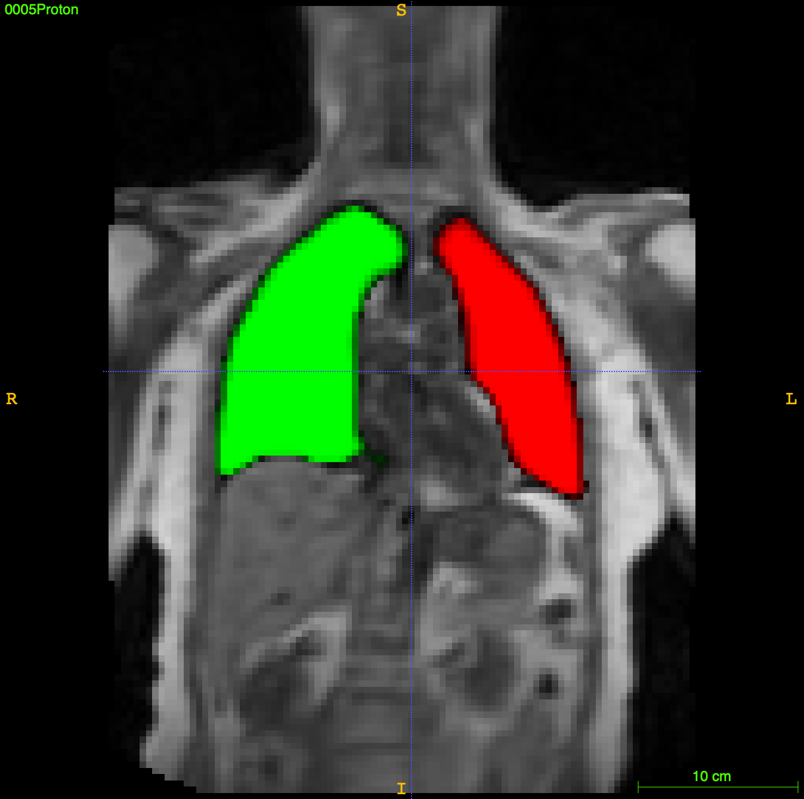

# App:  Lung MRI segmentation

Deep learning app made for proton-weighted MRI lung segmentation using ANTsRNet

## Citation

* Nicholas J. Tustison, Brian B. Avants, Zixuan Lin, Xue Feng, Nicholas Cullen, Jaime F. Mata, Lucia Flors, James C. Gee, Talissa A. Altes, John P. Mugler III, and Kun Qing.  Convolutional Neural Networks with Template-Based Data Augmentation for Functional Lung Image Quantification, _Academic Radiology_. [(pubmed)](https://www.ncbi.nlm.nih.gov/pubmed/30195415)

## Model training notes

* Training data: Proton lung MRI of various slice thickness
* Unet model (see ``Scripts/Training/``).
* Template-based data augmentation

## Sample usage

```
#
#  Usage:
#    Rscript doBrainExtraction.R inputImage outputPrefix reorientationTemplate
#

$ Rscript Scripts/doLungSegmentation.R Data/Example/0005Proton.nii.gz 0005Output Data/Template/T_template0.nii.gz

Reading reorientation template Data/Template/T_template0.nii.gz  (elapsed time: 0.02212381 seconds)
Using TensorFlow backend.
Loading weights filetrying URL 'https://ndownloader.figshare.com/files/13606799'
Content type 'application/octet-stream' length 58290064 bytes (55.6 MB)
==================================================
downloaded 55.6 MB

2018-11-19 18:21:26.107101: I tensorflow/core/platform/cpu_feature_guard.cc:140] Your CPU supports instructions that this TensorFlow binary was not compiled to use: AVX2 FMA
  (elapsed time: 1.159739 seconds)
Reading  Data/Example/0005Proton.nii.gz  (elapsed time: 0.01589298 seconds)
Normalizing to template  (elapsed time: 0.05258799 seconds)
Prediction and decoding (elapsed time: 1.054019 seconds)
Renormalize to native space and write image  (elapsed time: 0.1998382 seconds)

Total elapsed time: 1.058827 seconds
```

## Sample results


